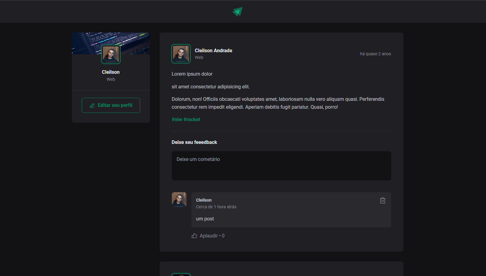

<div align="center">
  <h1>Busca Git</h1>
  <p>Aplicação de uma timeline de feed de post de um blog, desenvolvido em React utilizando TypeScript para fim de estudos de ambos.</p>
  
</div>

# 📒 Índice
* [Descrição](#descrição)
* [Requisitos Funcionais](#requisitos)
* [Tecnologias](#tecnologias)
* [Design](#design)
  * [Cores](#cores)
  * [Fontes](#fontes)
  * [Ícones](#ícones)
* [Instalação](#instalação)
* [Licença](#licença)

# 📃 <span id="descrição">Descrição</span>
Aplicação de uma timeline de feed de post de um blog, desenvolvido em React utilizando TypeScript para fim de estudos de ambos. Os estudos se propõe a entender o funcionamento de componentes, seu ciclo de vida, estados, componentizacao, props do React e a tipagem estática, interface impostos pelo TypeScript. Utiliza-se o [**Vite**](https://vitejs.dev/) como servidor e libs auxiliares [**date-fns**](https://date-fns.org/), [**date-fns**](https://date-fns.org/) e [**Phosphor React**](https://www.npmjs.com/package/phosphor-react) para o desenvolvimento.

# 📌 <span id="requisitos">Requisitos Funcionais</span>
- [x] Componentizacao<br>
- [x] Comentar<br>
- [x] Visualizar comentários com data e hora<br>
- [x] Curtir comentários<br>
- [x] Excluir comentários<br>

# 💻 <span id="tecnologias">Tecnologias</span>
- **HTML**
- **CSS**
- **JavaScript**
- **TypeScript**
- **Vite**
- **ReactJS**
- **date-fns**
- **ReactDom**

# 🎨 <span id="design">Design</span>
- O modelo final para versão desktop e mobile está disponível na pasta `./design`

- <span id="cores">Cores<br></span>
  * #323236<br>
  * #fff<br>
  * #e1e1e6<br>
  * #c4c4cc<br>
  * #8d8d99<br>
  * #323238<br>
  * #29292e<br>
  * #202024<br>
  * #121214<br>
  * #00B37E<br>
  * #00875f<br>
  * #F75A68<br>

- <span id="fontes">Fontes<br></span>
  * Roboto, sans-serif

- <span id="ícones">Ícones<br></span>
  * Phosphor React

# 🚀 <span id="instalação">Instalação</span>
```bash
  # Clone este repositório:
  $ git clone https://github.com/CleilsonAndrade/ignite_feed.git
  $ cd ./ignite_feed
```

# 📝 <span id="licença">Licença</span>
Esse projeto está sob a licença MIT. Veja o arquivo [LICENSE](LICENSE) para mais detalhes.

---

<p align="center">
  Feito com 💜 by CleilsonAndrade
</p>